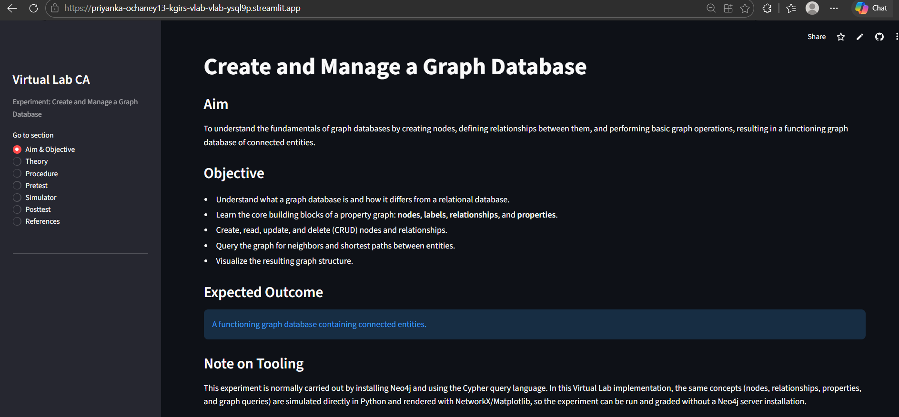
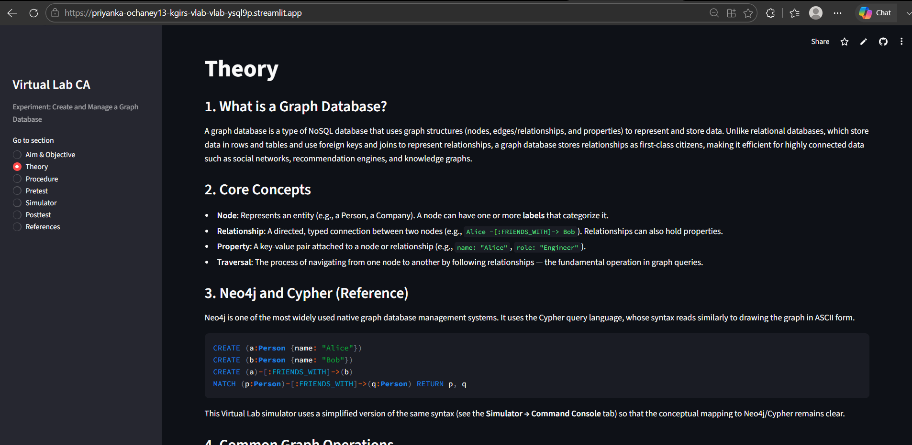
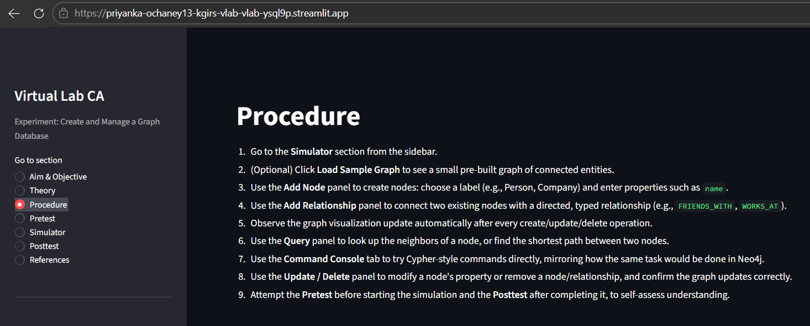
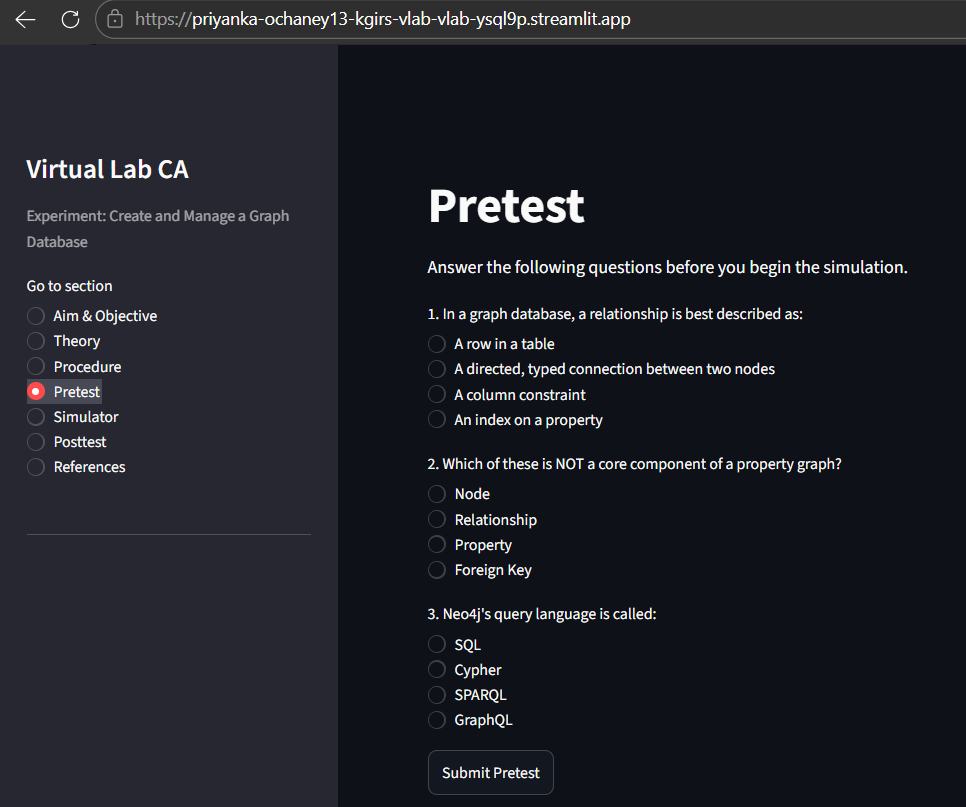
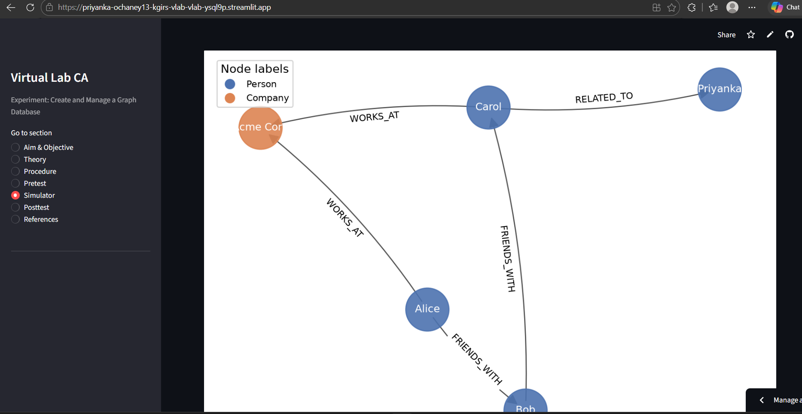
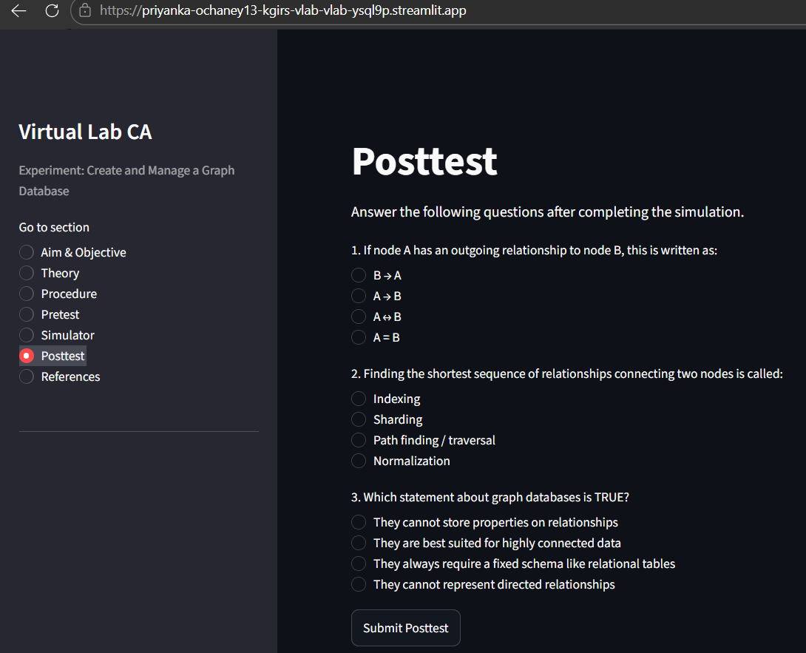
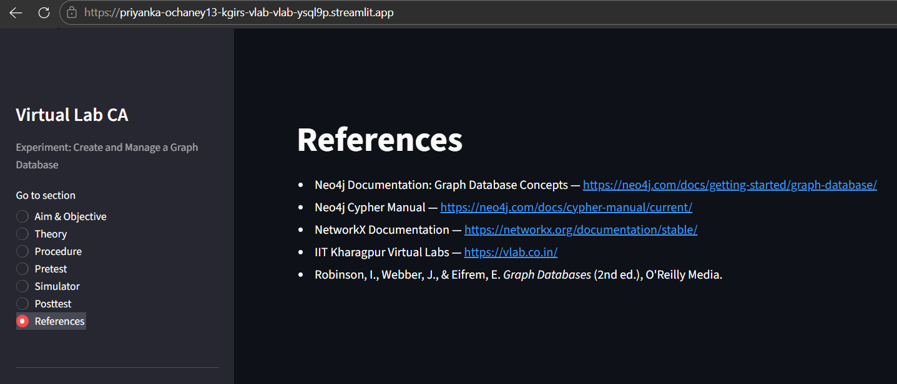

# Virtual Lab CA — Create and Manage a Graph Database

A Streamlit implementation of the Virtual Lab experiment **"Create and Manage
a Graph Database"**, built following the standard IIT Kharagpur Virtual Labs
page structure (Aim, Theory, Procedure, Pretest, Simulator, Posttest,
References).

Instead of installing and running an actual **Neo4j** server, this app
simulates a property graph database entirely in-memory using plain Python
data structures, and visualizes it with NetworkX + Matplotlib. All core
graph database concepts — nodes, labels, relationships, and properties — are
preserved; only the backend engine differs from a real Neo4j installation.

## Experiment Details

| | |
|---|---|
| **Title** | Create and Manage a Graph Database |
| **Brief Explanation** | Install Neo4j, create nodes and relationships, and perform basic graph operations. |
| **Expected Outcome** | A functioning graph database containing connected entities. |
| **Implementation note** | Simulated with Python + NetworkX instead of a Neo4j server, per assignment guidelines. |

## Features

- **Aim & Objective** — experiment aim, objectives, and expected outcome
- **Theory** — graph database fundamentals, Neo4j/Cypher reference, common operations, applications
- **Procedure** — step-by-step instructions for using the simulator
- **Pretest / Posttest** — 3 auto-graded multiple-choice questions each
- **Simulator**
  - **Graph View** — live, auto-updating visualization (color-coded by node label)
  - **Create / Update / Delete** — add nodes with labels & properties, add typed relationships, edit properties, delete nodes/relationships
  - **Query** — find neighbors of a node, find shortest path between two nodes
  - **Command Console** — simplified Cypher-style command interface (e.g. `CREATE (Person {name:"Alice"})`, `CREATE (Alice)-[:FRIENDS_WITH]->(Bob)`)
  - **Load Sample Graph** — loads a small 4-node demo graph to explore quickly
- **References** — links to Neo4j docs, Cypher manual, NetworkX docs, and the Virtual Labs portal


## Requirements

- Python 3.9+
- streamlit
- networkx
- matplotlib

## Setup

```bash
pip install streamlit networkx matplotlib
```

## Running the App

```bash
streamlit run vlab.py
```

This opens the app in your default browser (typically at
`http://localhost:8501`). Use the sidebar to move between the experiment
sections.

## How to Use the Simulator

1. Open the **Simulator** section from the sidebar.
2. Click **Load Sample Graph** for a quick, small demo (or start empty).
3. Go to **Create / Update / Delete** to:
   - Add a node with a label (e.g. `Person`, `Company`) and properties
   - Connect two nodes with a directed, typed relationship
   - Update a property on an existing node
   - Delete a node or a relationship
4. Check the **Graph View** tab — it updates automatically after every operation.
5. Use **Query** to look up a node's neighbors or the shortest path between two nodes.
6. Try the **Command Console** for Cypher-style commands:
   ```
   CREATE (Person {name:"Dave"})
   CREATE (Dave)-[:FRIENDS_WITH]->(Alice)
   ```

## Mapping to Real Neo4j (for reference)

| This app | Equivalent in Neo4j / Cypher |
|---|---|
| `CREATE (Person {name:"Alice"})` | `CREATE (a:Person {name: "Alice"})` |
| `CREATE (Alice)-[:FRIENDS_WITH]->(Bob)` | `MATCH (a:Person {name:"Alice"}), (b:Person {name:"Bob"}) CREATE (a)-[:FRIENDS_WITH]->(b)` |
| Query → Neighbors | `MATCH (a)-[r]-(b) WHERE a.name = "Alice" RETURN b, r` |
| Query → Shortest Path | `MATCH p = shortestPath((a)-[*]-(b)) RETURN p` |

## Submission Notes

- Format follows the IIT Kharagpur Virtual Labs experiment page structure.
- First Review: **21st–22nd September 2026**.
- Deliverable: single Python file (`vlab.py`), run via Streamlit.

## Deployed Link
- https://priyanka-ochaney13-kgirs-vlab-vlab-ysql9p.streamlit.app/

## Screenshots






